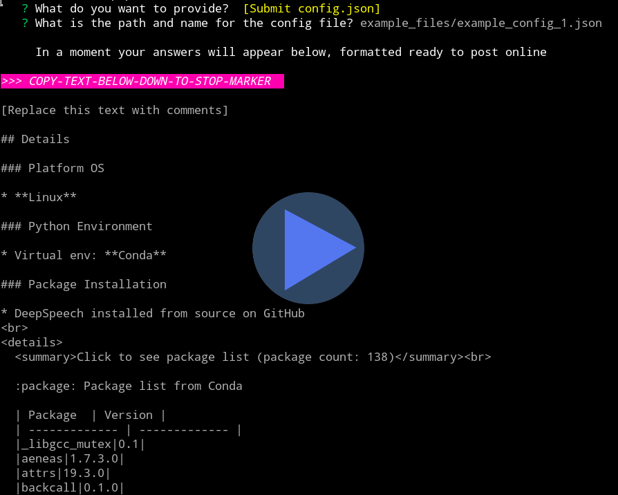

# GatherUp :gift:

# CURRENTLY IN ALPHA BUT HAVE A LOOK IF YOU LIKE :sparkles:

> GatherUp helps you post essential Python config details to GitHub or Discourse, all beautifully formatted

  

## How It Works

When something goes wrong or you want to discuss a project, a lot of the useful information is easily found on your computer but it can be tedious to gather it all together and post it neatly in a GitHub Issue or a Discourse Topic.

GatherUp can streamline and automate both the gathering and formatting steps, making this a lot easier, resulting in well formatted and helpful posts.

It focuses on the basic / common parts of your Python configuration, leaving you to craft the rest for anything more bespoke and to flesh out a meaningful question or comment (don't skimp on this last part! :slightly_smiling_face:)

## Usage

It has several command line options and offers built-in multi-lingual instructions in the terminal (please see Translation if you can help translate it into more languages)

There are four basic steps:
1. Answer some config related questions in the terminal
2. Copy the block of text (between the brightly coloured markers)
3. Paste the text into GitHub or Discourse
4. Edit if necessary and submit

Because it's working for you, and because you post the text as the final step, if there's anything you want to change or cut out, it's easy to do so, either by skipping the question all together or editing the text you'll post right before submitting it.

## Installation

DETAILS TO COME

## Limitations

:vertical_traffic_light: As it is intended as a small time-saver, several things are out of scope.

Some are out of scope for the foreseeable future, as I don't expect to develop them, and others are out of scope just because I am keen to get the basics working well first before expanding.

Remember that this is meant to save you time, so we mustn't be tempted to go down every rabbit hole! :hole::rabbit2:

<!-- See [Design Thoughts](design_thinking.md) for more background. -->

### Short term limits
Currently it is untested on Windows, Mac and other Linux installations besides Arch Linux and Raspberry Pi OS - if it can be made to work on any/all of these that would be great, but I would expect that to be gradual.

### Longer term limits / out of scope
Whilst the information it gathers is not set in stone, I am wary of extending it to cover too broad a range of scenarios: better to do a common core well than a huge swathe poorly and unreliably.

I am also strongly against anything that would appear to invade user privacy with the tool - the ethos is for the user to be in the driving seat, making informed decisions about what (if anything) they share.

## Translation

My hope is to get good coverage of major languages with the translations of the instructions (and in future the Question UI too).

If you are able to help or can recommend someone happy to volunteer then see [TRANSLATING.md](TRANSLATING.md) for more details.

## More Details

• [Customisation](CUSTOMISATION.md) • [License](LICENSE.txt) • [Contributors](CONTRIBUTORS.md)

• [Contributing](CONTRIBUTING.md) • [Change Log](CHANGELOG.md) • [Security](SECURITY.md)
